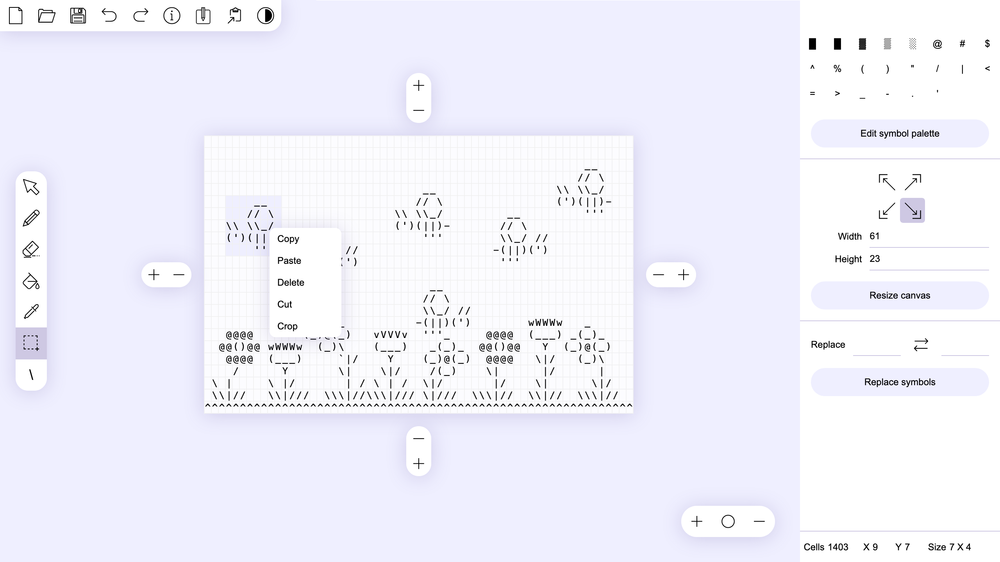
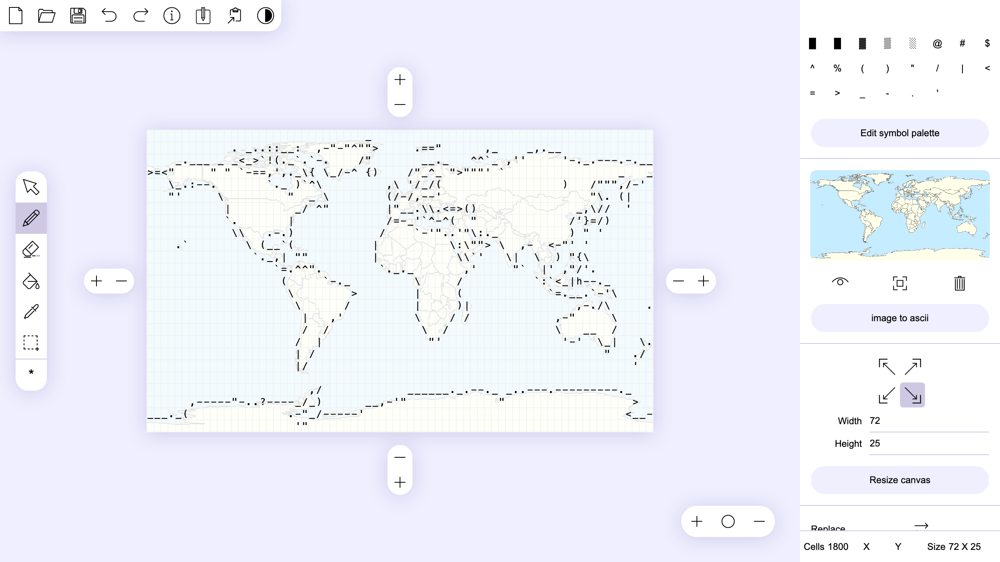
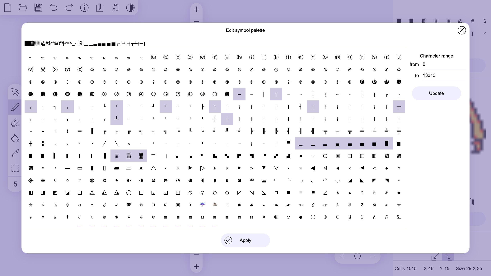
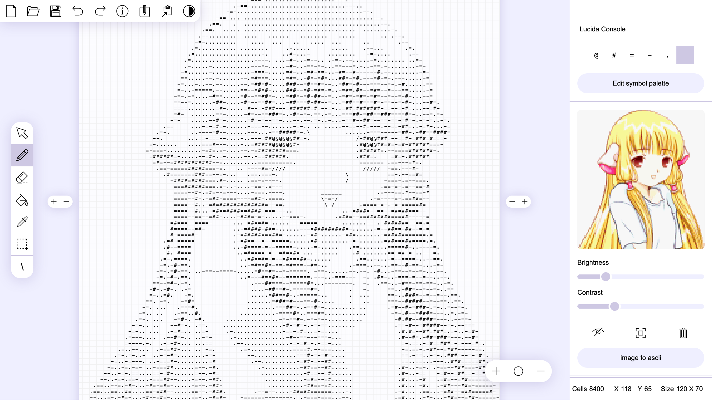
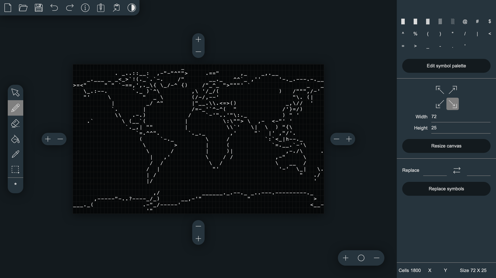
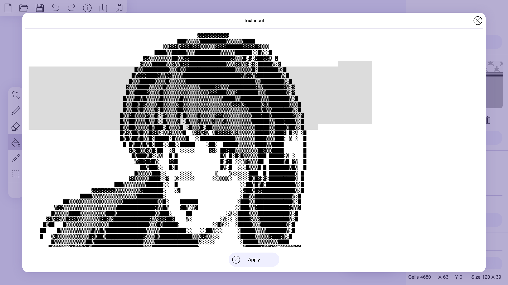

# ASCII Art Paint

free and open-source web-based application for creating and editing images consisting of text characters and hieroglyphs (ASCII graphics / Shift_JIS art / Kaomoji and many others).
Decorate your text and surprise your readers with an original social media post or blog post using ASCII graphics.
The tool does not require an internet connection and can work offline in a browser.

ASCII Art Paintは、ウェブブラウザで動作するオープンソースのASCII Graphics 制作ソフトです。ソーシャルメディアやブログの投稿を文字と記号で作った絵で装飾すれば、投稿が目に入った人たちの印象に残ること間違いなしです！ インターネット接続無しは不要。オフラインモードのブラウザで動作するので気軽に使用できます。

ASCII Graphics 文字や記号を組み合わせて絵のようにしたテキスト。意味は日本語の「アスキーアート(AA)」と近似していますが、アスキーアートが平仮名、片仮名、漢字、ラテン語アルファベットは勿論、その他の言語の文字や特殊文字まで用いるのに比べ、「ASCII Graphics」で使用する文字の種類は少なく、表現が乏しいものです。ただ、このソフトウェアはUnicode文字を一通り扱えるので、アスキーアートのような複雑な絵も制作できます。

> play online: https://kirilllive.github.io/tuesday-js/tools/ascii_paint.html 

> itch.io: https://kirill-live.itch.io

> Twitter: https://twitter.com/TuesdayJS_vn

> [Japanes translation and adaptation by Onigi ](https://twitter.com/onigi123)

# Simple interface / 簡潔で覚えやすいインターフェイス

The editor has basic functionality and an interface similar to most popular graphic editors for more convenient use.
You can use drag and drop to open a file. The usual txt file format is used to load and save data, which ensures full compatibility with other text editors.

機能と操作は一般的なグラフィック・エディターと同じなので、操作にはすぐ慣れるはずです。
ファイルの読み込みはドラッグ・アンド・ドロップ。作業データは汎用テキストファイルとして保存するので、このソフトウェアで作成したファイルを他のテキスト・エディターで編集することも、他のエディタ―で作成したファイルを読み込むことも差し障りなく行えます。

# Adapting bitmaps / ビットマップ画像の読み込み

If you open a bitmap in the editor, it will be displayed on the background of the canvas and can be used as a template or example to redraw the image into text symbols.

ビットマップ画像をソフトウェアに読み込ませると半透明画像として表示されます。こうして読み込ませた画像は下書きにしてもいいですし、新しい絵の参考資料にしてもいいでしょう。

# Customizable symbol palette / シンボル・パレットの設定

Using the built-in symbol table, you can get all the available symbols of a font in the selected range and use them to create your own symbol palette.
You can specify a symbol to draw without using the palette, but using the keyboard, including using keyboard shortcuts for special symbols. Optionally, you can load multiple fonts from .ttf, .woff and .woff2 files and use them instead of the default font.

「シンボル・パレットSymbol Palette」の設定画面(画面右上)で任意の文字コード範囲を指定すると、指定した範囲の文字が一覧表示されます。
ここで選択した文字は作業用の「シンボル・パレット」に加わるので、目的に適したパレットを作ってみましょう。直接キーボードで入力することもできます。

# Image to text conversion / 画像をテキストに変換

You can convert a bitmap image to text format by specifying the size and symbols palette, from the symbol for the darkest color to the symbol for the lightest color.
Thus, you have complete control over the conversion process to get the most suitable result.

読み込ませたビットマップ画像は、サイズと置き換えに使用する文字を指定すればテキストに自動変換できます。
上段・左側に指定した文字ほど暗い色の、下段・右側の文字ほど明るい色の置き換えに使います。画像に合わせて設定を調整すれば、良い感じに出力できます。

# Dark & light interface theme / ダーク版とライト版のインターフェイス

You can easily and quickly switch between dark and light user interfaces themes. 
this feature will show you how images will look on a dark background with light symbols or a light background with dark symbols.

ボタン一つでインターフェイスのダーク版(暗い背景)と、ライト版(明るい背景)とを切り替えることができるので、作成した絵が明度の異なる背景でどう映るかを即座に確認できます。画面左上に並ぶボタンの一番右です。

# Built-in text editor / 内蔵テキストエディター

The built-in text editor will allow you to work with the image in the same way as in a regular text editor. 
In addition this feature will allow you to quickly add data to the editor and copy it back to the clipboard.

画面左上、右から三番目から開ける内蔵のテキスト・エディターで、普通のテキスト・エディターのように文字を手打ちすることもできます。
他で作成したテキストの追加も、作成したテキストのコピーも簡単操作で一発です。

