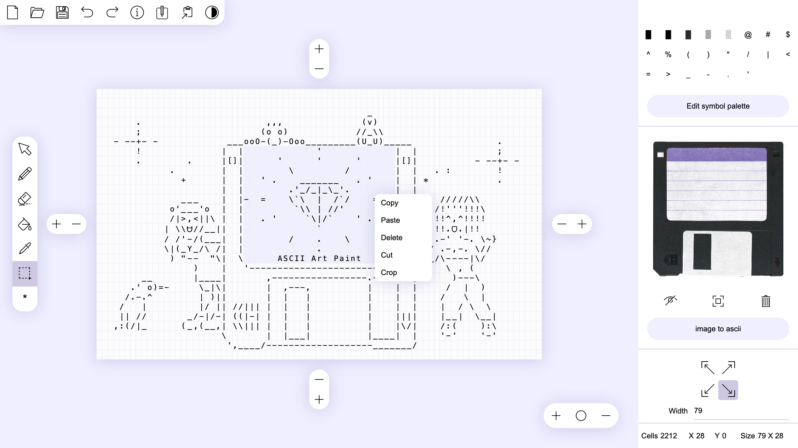

# ASCII Art Paint

free and open-source web-based application for creating and editing images consisting of text characters and hieroglyphs (ASCII graphics / Shift_JIS art / Kaomoji and many others) ( アスキーアート / AA / シフトJISアート / 顔文字 ).
Decorate your text and surprise your readers with an original social media post or blog post using ASCII graphics.
The tool does not require an internet connection and can work offline in a browser.

> play online: https://kirilllive.github.io/tuesday-js/tools/ascii_paint.html 

> itch.io: https://kirill-live.itch.io

> Twitter: https://twitter.com/TuesdayJS_vn

# Simple interface

The editor has basic functionality and an interface similar to most popular graphic editors for more convenient use.
You can use drag and drop to open a file. The usual txt file format is used to load and save data, which ensures full compatibility with other text editors.

# Adapting bitmaps

If you open a bitmap in the editor, it will be displayed on the background of the canvas and can be used as a template or example to redraw the image into text symbols.

# Image to text conversion

You can convert a bitmap image to text format by specifying the size and symbols palette, from the symbol for the darkest color to the symbol for the lightest color.
Thus, you have complete control over the conversion process to get the most suitable result.

# Customizable symbol palette

Using the built-in character table, you can get all the available characters of a font in the selected range and use them to create your own character palette.
You can specify a character to draw without using the palette, but using the keyboard, including using keyboard shortcuts for special characters.

# Dark & light interface theme

You can easily and quickly switch between dark and light user interfaces themes. 
this feature will show you how images will look on a dark background with light characters or a light background with dark characters.

# Built-in text editor

The built-in text editor will allow you to work with the image in the same way as in a regular text editor. 
In addition this feature will allow you to quickly add data to the editor and copy it back to the clipboard.

